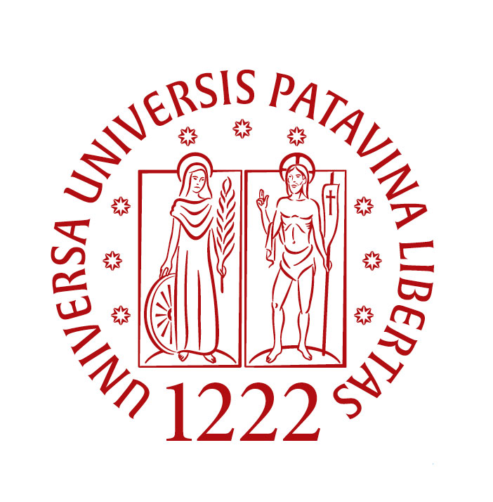
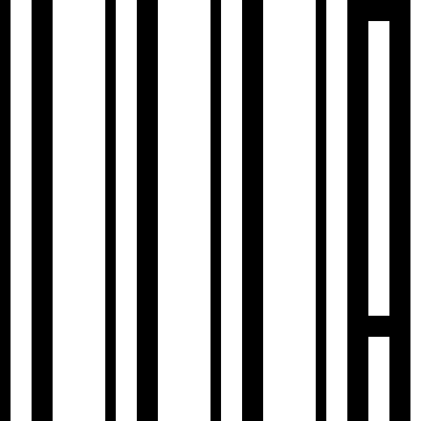
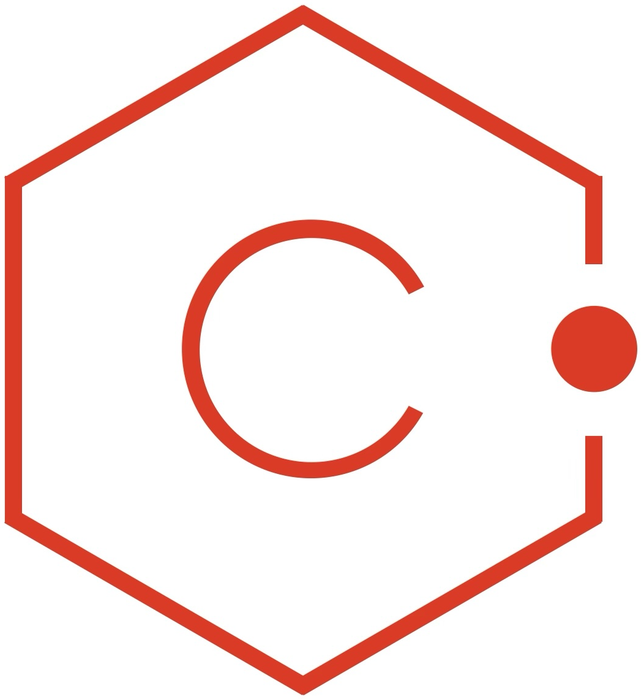

```{=html}
<section id="hero">
  <div id="nw-particles" aria-hidden="true"></div>

  <div class="nw-hero-inner">

    <div class="nw-hero-top">
    
      <div class="nw-hero-text">
        <h1>
          <span class="nw-name">
            <span class="nw-line nw-line-1">Information,</span>
            <span class="nw-line nw-line-2">Knowledge,</span>
            <span class="nw-accent">Intelligence.</span>
          </span>
        </h1>

        <div class="nw-type">
          I work on
          <span class="nw-typed"
            data-strings='[
              "Technology-Assisted Review",
              "Text Analytics",
              "Computational Terminology",
              "Digital Humanities",
              "Information Retrieval",
              "Machine Learning"
            ]'>
          </span>
          <span class="nw-caret">&nbsp;</span>
        </div>
      </div>

      <div class="nw-hero-media">
        
      </div>
      
          <div class="nw-hero-affiliation-logos">
      <a href="https://www.unipd.it/" target="_blank" rel="noopener">
        
      </a>
    
      <a href="https://iiia.dei.unipd.it/" target="_blank" rel="noopener">
        
      </a>
    
      <a href="https://centrico.dei.unipd.it/" target="_blank" rel="noopener">
        
      </a>
    </div>


    </div>
    
    
    <div class="nw-socials">
      <!-- keep your existing LinkedIn / GitHub / Scholar / ORCID links here -->
    </div>

    <p class="nw-affiliation">
      Associate Professor of Computer Engineering at the <a href="https://dei.unipd.it/" target="_blank" rel="noopener">Department of Information Engineering</a> of the University of Padua, Italy<br>
      Member of the <a href="https://iiia.dei.unipd.it/" target="_blank" rel="noopener">IIIA Research Group</a><br>
      Principal Investigator of <a href="https://centrico.dei.unipd.it/" target="_blank" rel="noopener">CENTRICO - Center of Studies for Computational Terminology</a>
    </p>

  </div>
</section>  

<section id="research" class="nw-section nw-alt">
  <div class="nw-section-inner">
    <h2 class="nw-title">Research Areas</h2>
    <p class="nw-subtitle">Where I focus my work</p>

    <p class="nw-lead">
      My research spans information retrieval, text analytics, evaluation,
      computational terminology, Bayesian machine learning, and digital humanities,
      with particular attention to technology-assisted review systems.
    </p>

    <div class="nw-grid nw-grid-2">

      <div class="nw-card">
        <h3>Technology-Assisted Review &amp; High-Recall Retrieval</h3>
        <p>
          Methods for high-recall information retrieval, relevance assessment,
          review prioritization, stopping strategies, and human-in-the-loop search
          under limited assessment budgets.
        </p>
        <div class="nw-chips">
          <span class="nw-chip">Technology-Assisted Review</span>
          <span class="nw-chip">High-Recall Retrieval</span>
          <span class="nw-chip">Relevance Assessment</span>
          <span class="nw-chip">Stopping Methods</span>
        </div>
      </div>

      <div class="nw-card">
        <h3>Text Analytics &amp; Information Extraction</h3>
        <p>
          Methods for extracting structured information from text, with particular
          attention to specialized and domain-specific language.
        </p>
        <div class="nw-chips">
          <span class="nw-chip">Named Entity Recognition</span>
          <span class="nw-chip">Relation Extraction</span>
          <span class="nw-chip">LLMs</span>
          <span class="nw-chip">Domain-specific NLP</span>
        </div>
      </div>

      <div class="nw-card">
        <h3>Computational Terminology &amp; Knowledge Representation</h3>
        <p>
          Computational methods for terminology, multilingual knowledge
          representation, FAIR terminology resources, knowledge graphs,
          and interoperable semantic data.
        </p>
        <div class="nw-chips">
          <span class="nw-chip">Terminology</span>
          <span class="nw-chip">Knowledge Graphs</span>
          <span class="nw-chip">FAIR Data</span>
          <span class="nw-chip">Linked Data</span>
        </div>
      </div>

      <div class="nw-card">
        <h3>Bayesian Machine Learning</h3>
        <p>
          Bayesian methods for learning, estimation, uncertainty quantification,
          and decision making, particularly in settings with limited,
          incomplete, or costly observations.
        </p>
        <div class="nw-chips">
          <span class="nw-chip">Bayesian Inference</span>
          <span class="nw-chip">Uncertainty</span>
          <span class="nw-chip">Prevalence Estimation</span>
          <span class="nw-chip">Decision Making</span>
        </div>
      </div>

      <div class="nw-card">
        <h3>Evaluation of Information Access and AI Systems</h3>
        <p>
          Experimental and statistical evaluation of information retrieval,
          recommender, and AI systems, with emphasis on reliability,
          reproducibility, uncertainty, and meaningful performance assessment.
        </p>
        <div class="nw-chips">
          <span class="nw-chip">Evaluation</span>
          <span class="nw-chip">Information Access</span>
          <span class="nw-chip">Statistical Analysis</span>
          <span class="nw-chip">AI Evaluation</span>
        </div>
      </div>
      
      <div class="nw-card">
        <h3>Digital Humanities</h3>
        <p>
          Computational approaches to humanities research, with particular
          interest in digital scholarly resources, research infrastructures,
          FAIR data, and interdisciplinary methods.
        </p>
        <div class="nw-chips">
          <span class="nw-chip">Digital Humanities</span>
          <span class="nw-chip">Research Infrastructures</span>
          <span class="nw-chip">Open Science</span>
          <span class="nw-chip">FAIR</span>
        </div>
      </div>
    </div>
  </div>
</section>
```

::: {.nw-section #publications}
::: {.nw-section-inner}
<h2 class="nw-title">Featured Publications</h2>
<p class="nw-subtitle">The most recent articles here</p>

::: {#featured-pubs .nw-cites}
:::

<div class="nw-btns nw-section-more"><a class="nw-btn nw-btn-ghost" href="publications/">See More Publications →</a></div>
:::
:::

::: {.nw-section .nw-alt .nw-wash-l #projects}
::: {.nw-section-inner}
<h2 class="nw-title">Featured Projects</h2>
<p class="nw-subtitle">The latest projects I've been involved in</p>

::: {#featured-projects .nw-projects}
:::

<div class="nw-btns nw-section-more"><a class="nw-btn nw-btn-ghost" href="projects/">Browse All Projects →</a></div>
:::
:::


::: {.nw-section #teaching}
::: {.nw-section-inner}
<h2 class="nw-title">Featured Courses</h2>
<p class="nw-subtitle">Courses I have recently taught or will be teaching soon</p>

::: {#featured-courses .nw-courses}
:::

<div class="nw-btns nw-section-more"><a class="nw-btn nw-btn-ghost" href="teaching/">Browse All Courses →</a></div>
:::
:::


::: {.nw-section .nw-alt #news}
::: {.nw-section-inner}

<h2 class="nw-title">Featured News</h2>
<p class="nw-subtitle">Latest news from what I write on LinkedIn</p>

::: {#featured-news .nw-news}
:::

<div class="nw-btns nw-section-more"><a class="nw-btn nw-btn-ghost" href="news/">Browse All News</a></div>

:::
:::


```{=html}

<section id="contact" class="nw-section">
  <div class="nw-section-inner">
    <h2 class="nw-title">Get In Touch</h2>
    <p class="nw-subtitle">Contact information</p>

    <div class="nw-contact-card">

      <div class="nw-contact-intro">
        <h3>Contact</h3>
        <p>
          For research collaborations, academic enquiries,
          and student matters, the best way to reach me is by email.
        </p>
      </div>

      <div class="nw-contact-details">
        <ul class="nw-contact-list">

          <li>
            <span class="nw-contact-icon">
              <svg viewBox="0 0 24 24" fill="none" stroke="currentColor"
                   stroke-width="1.5" stroke-linecap="round"
                   stroke-linejoin="round" aria-hidden="true">
                <rect x="3" y="5" width="18" height="14" rx="2"/>
                <path d="M3 7l9 6l9 -6"/>
              </svg>
            </span>
            <span class="nw-contact-item">
              <small>Email</small>
              <br/>
              <a href="mailto:giorgiomaria.dinunzio@unipd.it">
                giorgiomaria.dinunzio@unipd.it
              </a>
            </span>
          </li>

          <li>
            <span class="nw-contact-icon">
              <svg viewBox="0 0 24 24" fill="none" stroke="currentColor"
                   stroke-width="1.5" stroke-linecap="round"
                   stroke-linejoin="round" aria-hidden="true">
                <path d="M9 11a3 3 0 1 0 6 0a3 3 0 0 0 -6 0"/>
                <path d="M17.657 16.657l-4.243 4.243a2 2 0 0 1 -2.827 0l-4.244 -4.243a8 8 0 1 1 11.314 0z"/>
              </svg>
            </span>
            <span class="nw-contact-item">
              <small>Location</small>
              <br/>
              <span>Padova, Italy</span>
            </span>
          </li>

          <li>
            <span class="nw-contact-icon">
              <svg viewBox="0 0 24 24" fill="none" stroke="currentColor"
                   stroke-width="1.5" stroke-linecap="round"
                   stroke-linejoin="round" aria-hidden="true">
                <rect x="3" y="7" width="18" height="13" rx="2"/>
                <path d="M8 7v-2a2 2 0 0 1 2 -2h4a2 2 0 0 1 2 2v2"/>
                <path d="M12 12v.01"/>
                <path d="M3 13a20 20 0 0 0 18 0"/>
              </svg>
            </span>
            <span class="nw-contact-item">
              <small>Office</small>
              <br>
              <span>
                Via Gradenigo 6a, 35131, Padova, Italy<br>
                Department of Information Engineering<br>
                University of Padova
              </span>
            </span>
          </li>

        </ul>
      </div>

    </div>
  </div>
</section>
```
